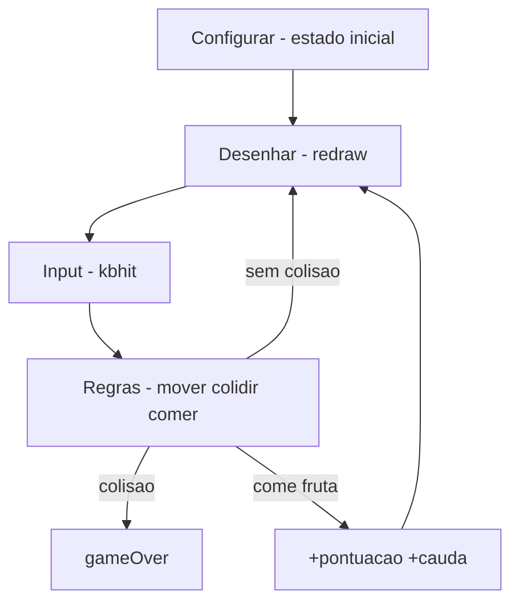

# 🐍 snake-c- — Jogo da Cobrinha em C++
<p align="center">
  
  <a href="https://github.com/panda12332145/snake-c-/commits/main"></a>
  <a href="https://github.com/panda12332145/snake-c-"></a>
  
</p>
---
## 🔖 Resumo

O clássico **jogo da cobrinha** implementado em **C++** de forma console: mapa 20×10 desenhado com `system("cls")`, cobra com cauda crescente, fruta aleatória, pontuação e controles por `conio.h` (WASD/setas). Projeto introdutório de lógica de jogo em C++.

### ✨ Funcionalidades Principais

- ✅ Loop de jogo com estados (configurar, desenhar, input, regras)
- ✅ Cobra com vetor de cauda (`caudaX/caudaY`)
- ✅ Fruta aleatória + pontuação
- ✅ Controle de direção sem travar o loop (`kbhit`)
- ✅ Colisão com parede e com a própria cauda

## 📽 Demonstração

```text
$ g++ snake.cpp -o snake && ./snake
####################
#        o          #
#         #<-cobra  #
#            *      #
####################
Pontuacao: 10
```

## ⚙️ Explicação das Partes Importantes

### Estado do jogo

```cpp
bool gameOver;
const int largura = 20, altura = 10;
int x, y, frutaX, frutaY, pontuacao;
int caudaX[100], caudaY[100], nCauda;
enum Direcao { STOP = 0, ESQUERDA, DIREITA, CIMA, BAIXO };
```

> Todo o estado em variáveis globais simples — padrão didático de jogos de terminal.

### Desenho do mapa

```cpp
void Desenhar() {
    system("cls");
    // bordas + corpo + fruta + placar, caractere a caractere
}
```

> Redesenha a tela inteira a cada frame (abordagem clássica de console).

### Input

```cpp
if (kbhit()) {
    switch (getch()) {
        case 'w': dir = CIMA; break;
        case 's': dir = BAIXO; break;
        ...
    }
}
```

> `kbhit` não bloqueia o loop — o jogo continua rodando enquanto espera tecla.

## 🔄 Fluxo de Trabalho / Arquitetura



## 📂 Estrutura do Projeto

```plaintext
snake-c-/
├── snake.cpp    # Jogo completo em um arquivo
└── README.md
```

## 🛠️ Tecnologias

| Ferramenta | Uso |
|---|---|
| **C++** | Linguagem |
| **conio.h** | kbhit/getch (Windows) |
| **system("cls")** | Limpeza de tela |

## ▶️ Instalação

```bash
git clone https://github.com/panda12332145/snake-c-.git
cd snake-c-
```

## 🚀 Execução

```bash
# Windows (MinGW):
g++ snake.cpp -o snake.exe && snake.exe
# Linux: substitua conio.h/system("cls") por equivalents (ncurses)
```

## ⚠️ Limitações

- Windows-first (conio.h / cls)
- Redesenha tela inteira (piscar em terminais lentos)
- Sem modo pausa

## 🚀 Roadmap

- [ ] Port Linux/macOS (ncurses)
- [ ] Velocidade progressiva
- [ ] High score

## 📄 Licença

Todos os direitos reservados ao autor.

---

## 👾 Autor

<p align="center">
  
</p>

<p align="center">Feito por <strong>Panda12332145</strong> 👋🏽</p>

---

## 🧑‍💻 Sobre Mim

Sou apaixonado por **Física Teórica, Cibersegurança e Desenvolvimento de Sistemas**. Tenho grande interesse em programação de baixo nível, engenharia reversa, automação, sistemas Windows, criptografia e segurança ofensiva. Também gosto bastante de música, filosofia e computação avançada.

---

## 🌐 Redes

* **Site:** [https://panda-h0me.netlify.app/](https://panda-h0me.netlify.app/)
* **YouTube:** [https://www.youtube.com/@X86BinaryGhost](https://www.youtube.com/@X86BinaryGhost)
* **Instagram:** [https://www.instagram.com/01pandal10/](https://www.instagram.com/01pandal10/)
* **GitHub:** [https://github.com/panda12332145](https://github.com/panda12332145)
* **LinkedIn:** [linkedin.com/in/athos-da-boanergis](https://www.linkedin.com/in/athos-d%C3%A3-boanergis-5585a4288/)

---

## 🚀 Áreas de Interesse

* **Cibersegurança Avançada** 🔒
* **Hacking & Engenharia Reversa** 💻
* **Computação de Baixo Nível** 🖥️
* **Matemática e Física Teórica** 📐⚛️
* **Desenvolvimento de Ferramentas de Segurança** 🛠️

_"Conhecimento é poder, e domínio técnico vem da compreensão profunda dos sistemas."_

---

## 📞 Contato & Suporte

Para colaborações, dúvidas ou sugestões:

📧 **E-mail:** [athos.cybersec@gmail.com](mailto:athos.cybersec@gmail.com)

🐛 **Reportar Bug:** [Abrir Issue](https://github.com/panda12332145/snake-c-/issues)

💡 **Sugerir Melhoria:** [Discussions](https://github.com/panda12332145/snake-c-/discussions)
